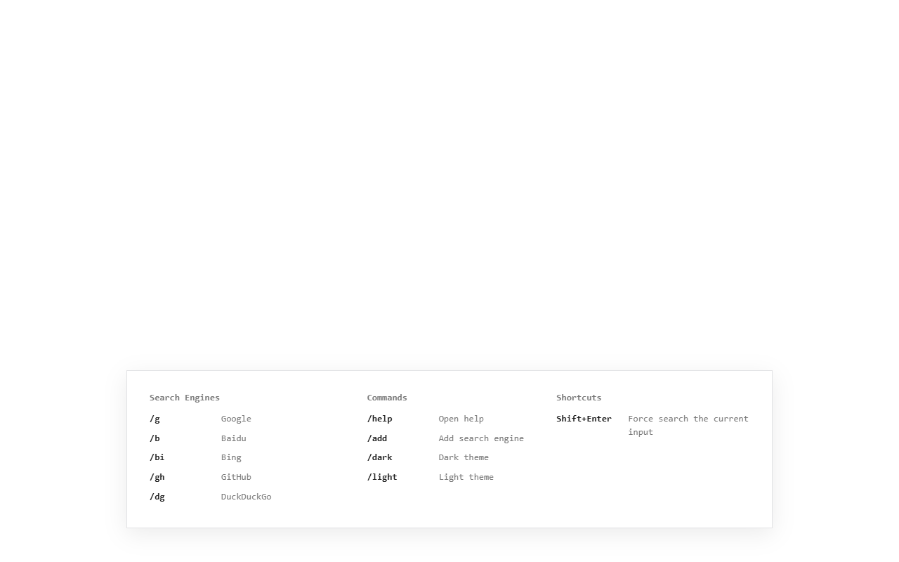

# SimpleSearch

A minimalist terminal-style search launcher for your new tab page.

SimpleSearch replaces the new tab page with a quiet, keyboard-first search box. Type a query and press Enter to search, or use slash commands to search with a specific engine.



## Features

- Keyboard-first new tab search.
- Normal searches use the browser's configured default search engine through Chrome Search API.
- One-shot search commands for Google, Baidu, Bing, GitHub, DuckDuckGo, and custom engines.
- Custom search engines with `%s` URL templates, editing, deletion, and custom flash colors.
- Direct URL, domain, IP, and localhost navigation.
- `Shift+Enter` to force search when a URL-like input should be searched instead of opened.
- English and Simplified Chinese UI based on the browser language.
- System, light, and dark themes.
- No background script, no remote code, and no host permissions.

## Commands

Type a command and press Space to arm it for the next search.

| Command | Action |
| --- | --- |
| `/g` | Google |
| `/b` | Baidu |
| `/bi` | Bing |
| `/gh` | GitHub |
| `/dg` | DuckDuckGo |
| `/help` | Open help |
| `/add` | Add custom search engines |
| `/dark` | Dark theme |
| `/light` | Light theme |

Slash text remains searchable. For example, `/b` + Enter searches `/b`; only `/b` + Space runs the command.

## Custom Search Engines

Open `/add`, then add a command, name, URL template, and optional color. Use `%s` where the search text should go. If the protocol is omitted, SimpleSearch saves the URL with `https://`.

```text
Command: mdn
Name: MDN
URL: https://developer.mozilla.org/search?q=%s
```

Then search with:

```text
/mdn array map
```

## Browser Extension

SimpleSearch is a Manifest V3 new tab extension. It uses the `search` permission so normal searches can respect the browser's configured default search engine.

To load it locally:

1. Open `chrome://extensions` or `edge://extensions`.
2. Enable developer mode.
3. Choose `Load unpacked`.
4. Select this project folder.

Opening a new tab will show SimpleSearch.

To create a local extension ZIP:

```sh
npm run package:extension
```

The generated package is written to `dist/`.

## Development

Run the tests and extension checks:

```powershell
npm run verify
```

## License

SimpleSearch is licensed under the GNU General Public License v3.0 only. See `LICENSE` for details.
